# LiveMD Feature Demo

This file exercises every rendering feature. If something looks wrong here, it's broken.

---

## 1. Text basics

**Bold**, *italic*, ***bold italic***, ~~strikethrough~~, `inline code`, and a [link](https://github.com/erkantaylan/livemd).
Autolink test: https://example.com and www.example.com

> Blockquote level 1
> > Nested blockquote
> > > Level 3 with **bold** and `code`

Hard wrap test: this line
should break here (WithHardWraps is on).

## 2. Headings

### H3
#### H4
##### H5
###### H6

## 3. Lists

1. Ordered one
2. Ordered two
   1. Nested ordered
   2. Another
      - Mixed unordered inside ordered
      - Deeper
        - [ ] Task inside a 4-level nest
- Unordered
- With items
  - Nested

### Task lists

- [x] Done item
- [ ] Pending item
- [ ] ~~Cancelled item~~

## 4. Tables

| Feature | Status | Notes |
|---------|:------:|------:|
| GFM tables | ✔ | center + right aligned columns |
| Long cell | ✔ | This is a much longer cell to test wrapping behavior of wide-ish content in tables |
| `code in cell` | ✔ | **bold in cell** |

Wide table (horizontal scroll test):

| A | B | C | D | E | F | G | H | I | J | K | L |
|---|---|---|---|---|---|---|---|---|---|---|---|
| 1 | 2 | 3 | 4 | 5 | 6 | 7 | 8 | 9 | 10 | 11 | 12 |

## 5. Code blocks

```go
// Go with syntax highlighting
func main() {
	msg := fmt.Sprintf("hello %s", "livemd")
	fmt.Println(msg)
}
```

```python
# Python
def fib(n: int) -> int:
    return n if n < 2 else fib(n - 1) + fib(n - 2)
```

```json
{ "name": "livemd", "tags": ["markdown", "live"], "port": 3001 }
```

```
plain fenced block with no language
<html> entities & such should be escaped literally
```

## 6. Math (KaTeX)

Inline: $e^{i\pi} + 1 = 0$ and $\frac{a}{b} \neq \sqrt{c}$

Display:

$$
\int_{-\infty}^{\infty} e^{-x^2}\,dx = \sqrt{\pi}
$$

$$
\begin{pmatrix} a & b \\ c & d \end{pmatrix}
\begin{pmatrix} x \\ y \end{pmatrix}
=
\begin{pmatrix} ax + by \\ cx + dy \end{pmatrix}
$$

## 7. Inline HTML (unsafe mode is on)

<details>
<summary>Click to expand a &lt;details&gt; block</summary>

Hidden content with **markdown** inside.

</details>

<kbd>Ctrl</kbd> + <kbd>C</kbd> — <mark>highlighted</mark> — <sub>sub</sub> and <sup>sup</sup>

## 8. Mermaid — one of each type

### 8.1 Flowchart

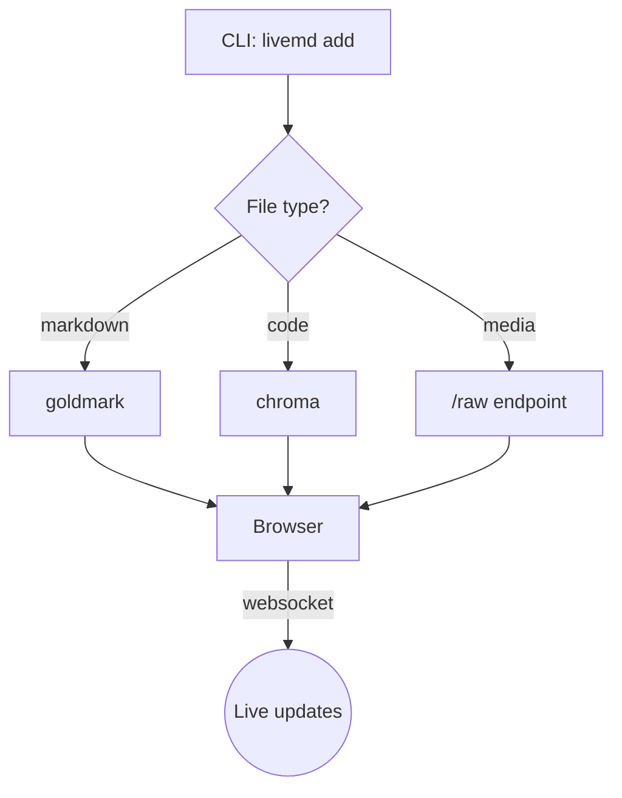

### 8.2 Sequence diagram

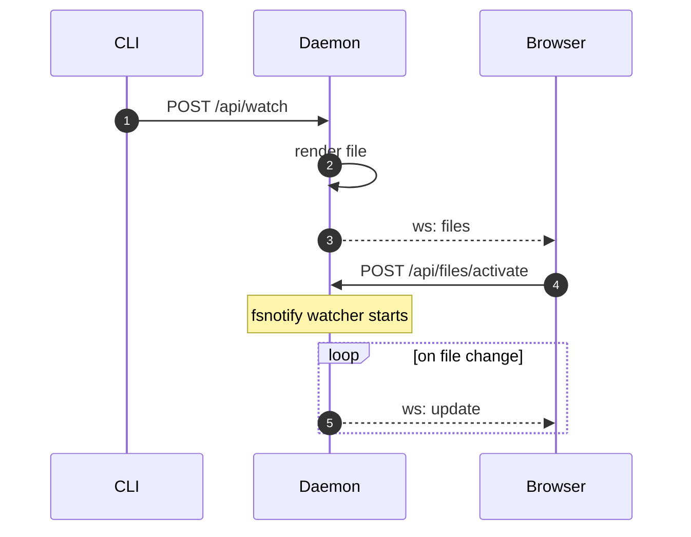

### 8.3 Class diagram

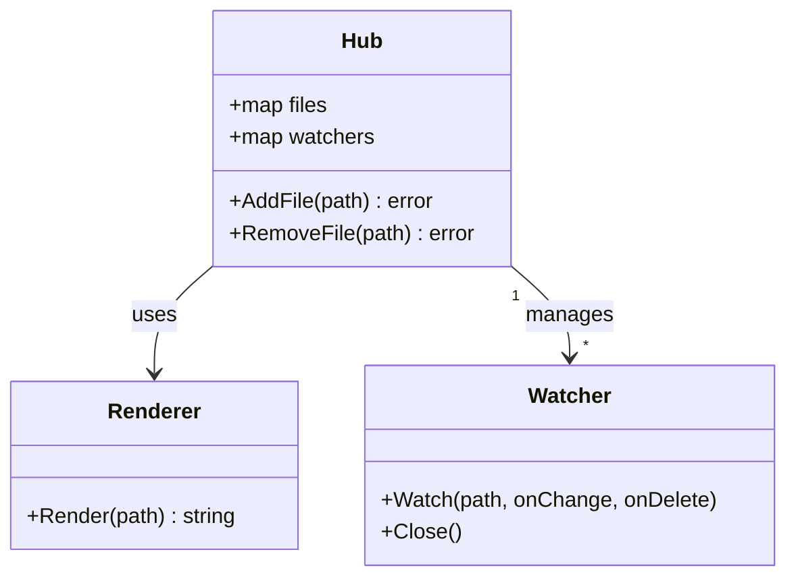

### 8.4 State diagram

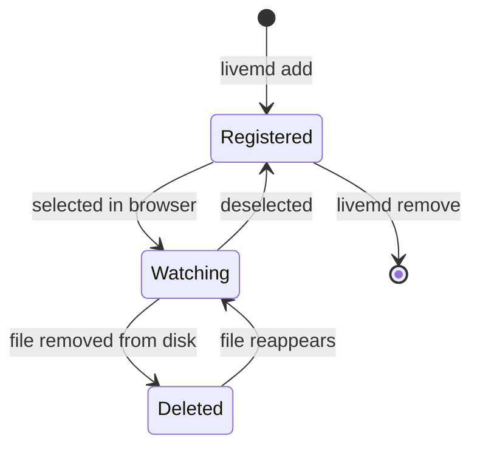

### 8.5 Entity relationship

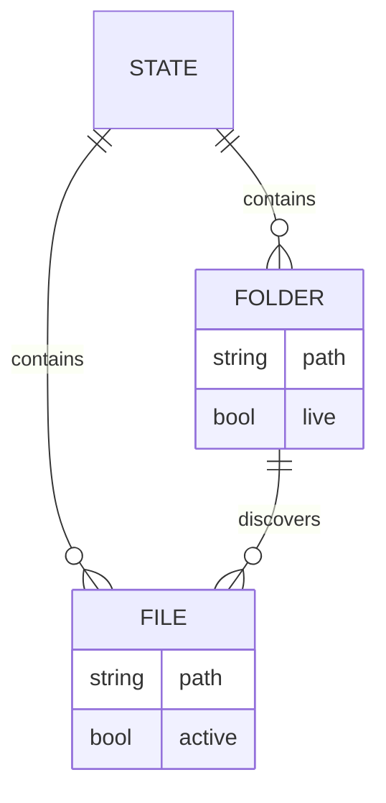

### 8.6 Gantt chart

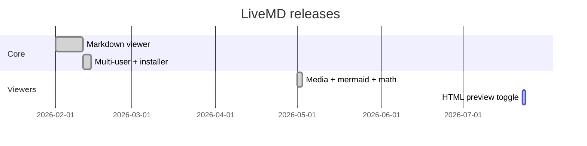

### 8.7 Pie chart

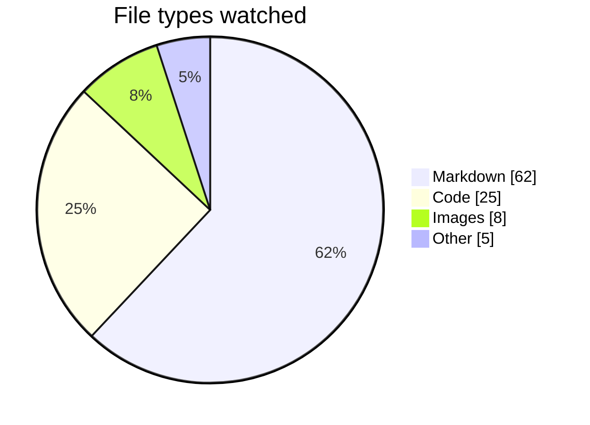

### 8.8 Git graph

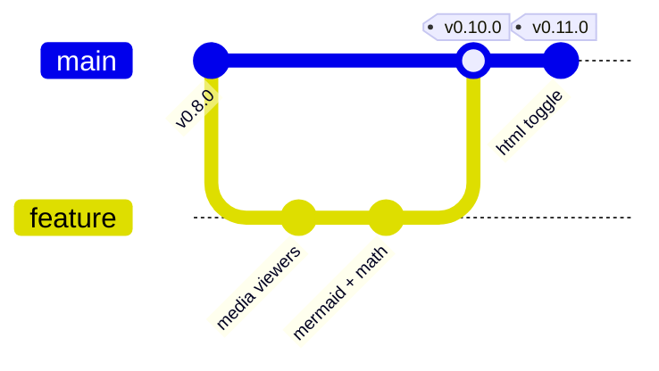

### 8.9 User journey

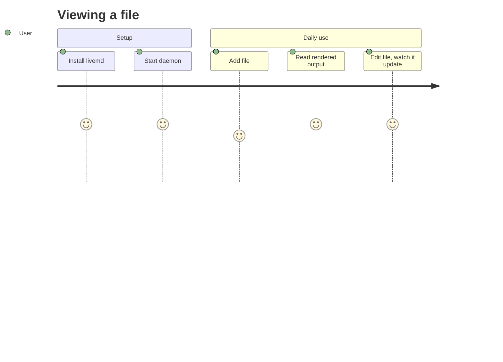

### 8.10 Mindmap

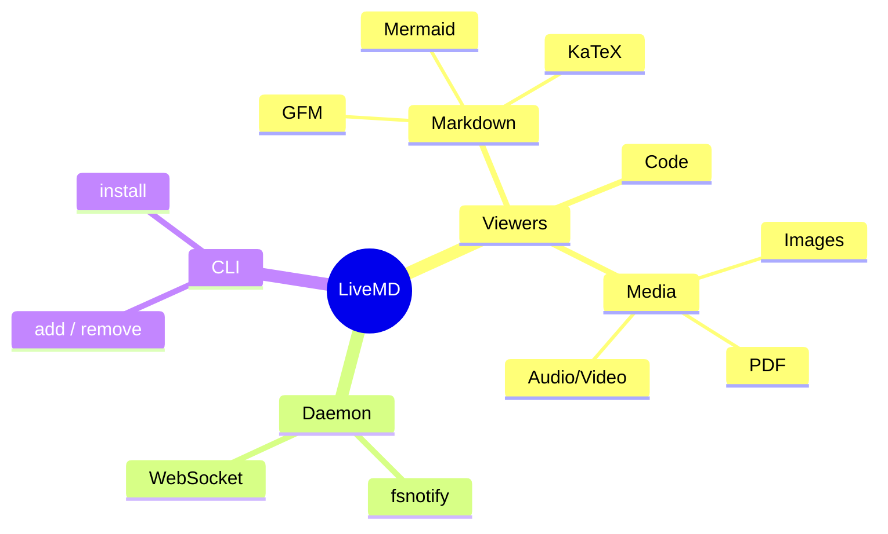

### 8.11 Timeline

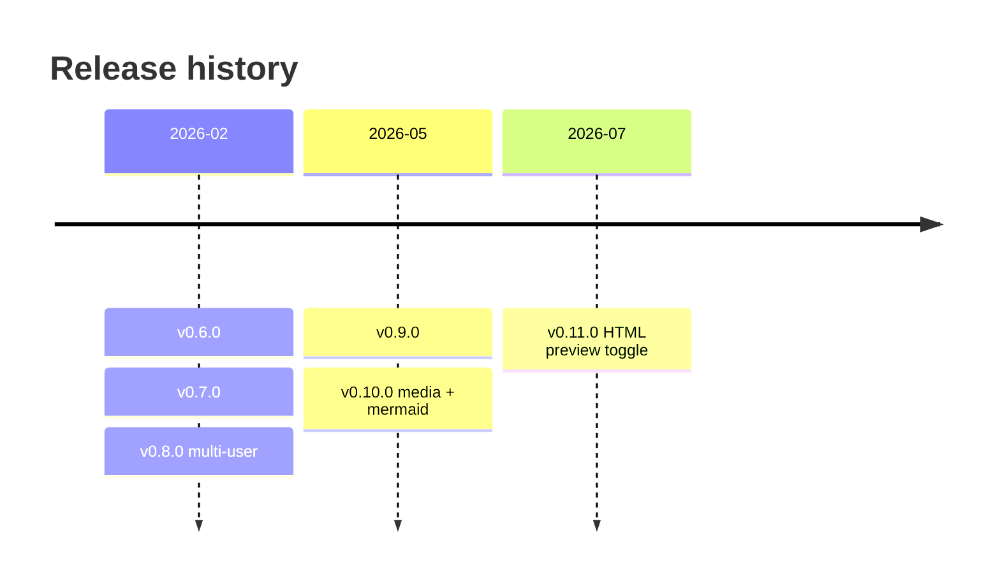

### 8.12 Quadrant chart

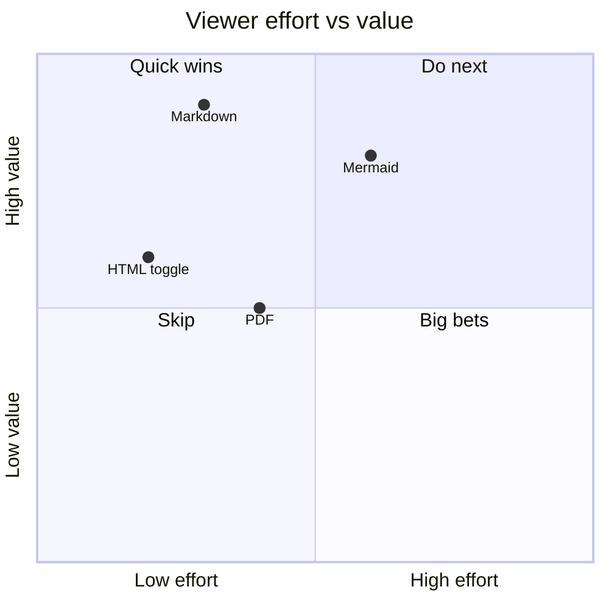

## 9. Mermaid — limit testing

### 9.1 Large flowchart (50 nodes)

```mermaid
graph LR
    n0 --> n1 --> n2 --> n3 --> n4 --> n5 --> n6 --> n7 --> n8 --> n9
    n9 --> n10 --> n11 --> n12 --> n13 --> n14 --> n15 --> n16 --> n17 --> n18 --> n19
    n19 --> n20 --> n21 --> n22 --> n23 --> n24 --> n25 --> n26 --> n27 --> n28 --> n29
    n29 --> n30 --> n31 --> n32 --> n33 --> n34 --> n35 --> n36 --> n37 --> n38 --> n39
    n39 --> n40 --> n41 --> n42 --> n43 --> n44 --> n45 --> n46 --> n47 --> n48 --> n49
    n0 --> n25
    n10 --> n35
    n5 --> n45
    n49 --> n0
```

### 9.2 Dense subgraph nesting

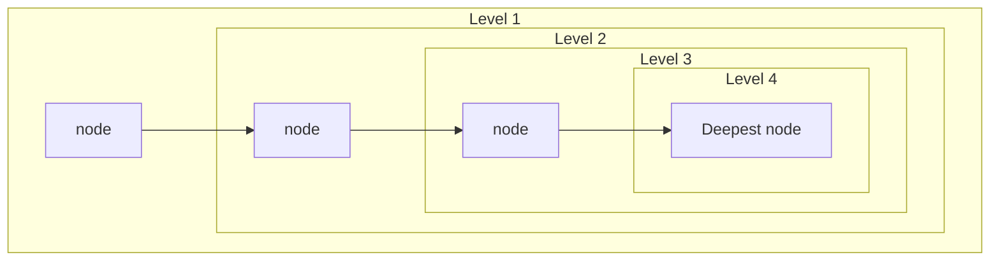

### 9.3 Long sequence diagram (20 messages)

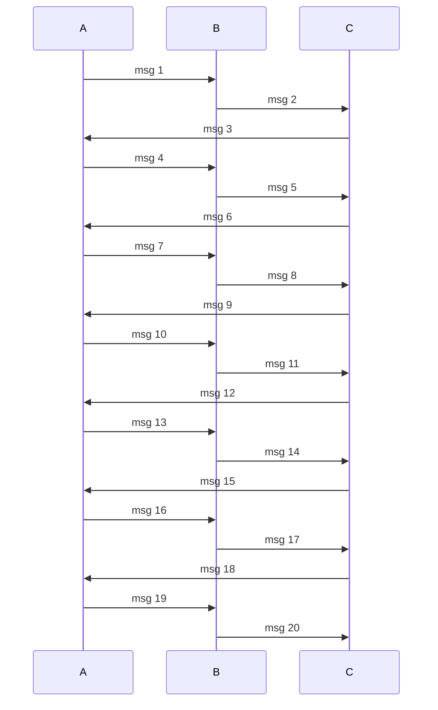

### 9.4 Invalid mermaid (error handling — should fail gracefully, not break the page)

```mermaid
graph TD
    this is not ---> valid mermaid syntax {{{
```

### 9.5 Unicode + special characters in labels

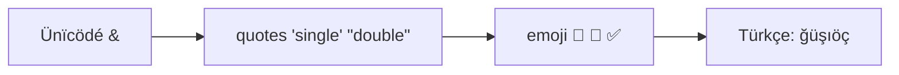

## 10. Images

External image (network required):


Broken image (alt text fallback):


## 11. Edge cases

Empty code fence:

```
```

Escaped characters: \*not italic\*, \`not code\`, \# not a heading

Horizontal rules:

---
***
___

A very long unbroken word to test overflow: aaaaaaaaaaaaaaaaaaaaaaaaaaaaaaaaaaaaaaaaaaaaaaaaaaaaaaaaaaaaaaaaaaaaaaaaaaaaaaaaaaaaaaaaaaaaaaaaaaaaaaaaaaaa

Literal HTML entities: &amp; &lt; &gt; &copy; &mdash;

Footnote syntax[^1] (not enabled in goldmark GFM — should render as plain text, that's expected).

[^1]: this will not become a real footnote.

*End of demo — if everything above rendered, all viewers are healthy.*
